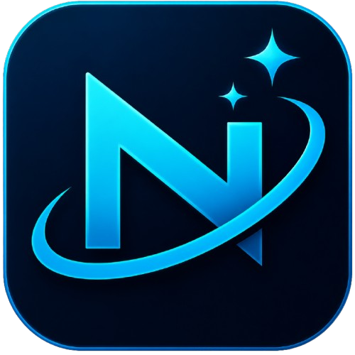
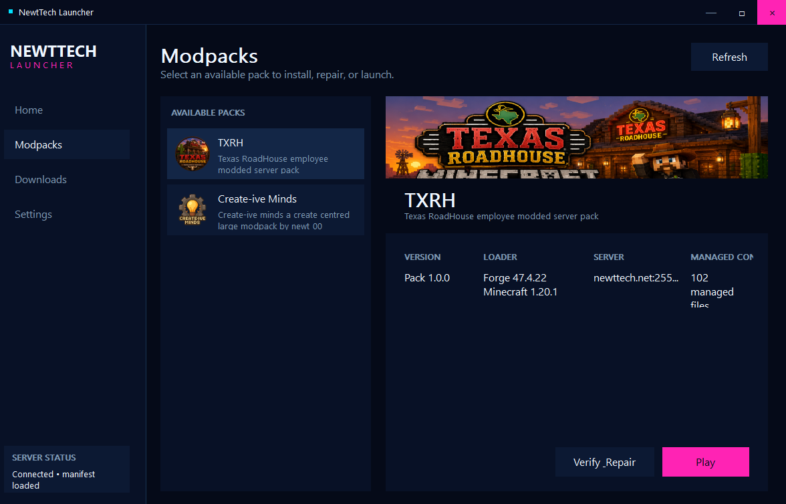
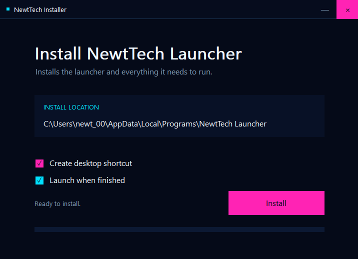
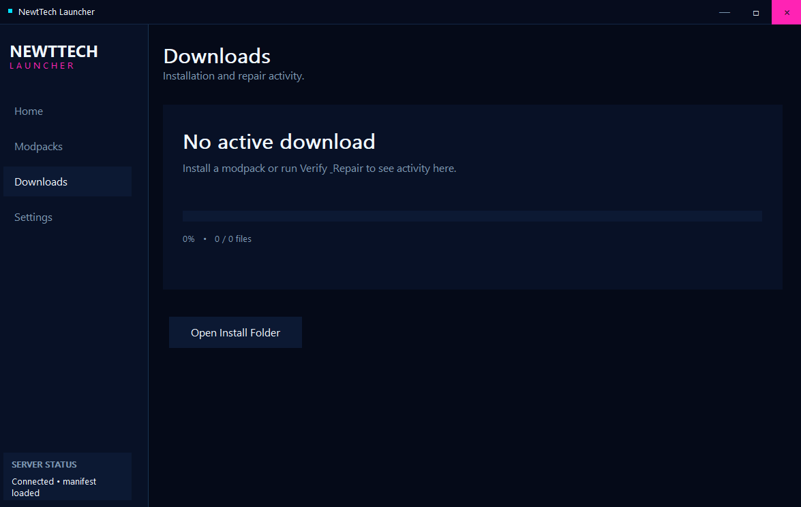
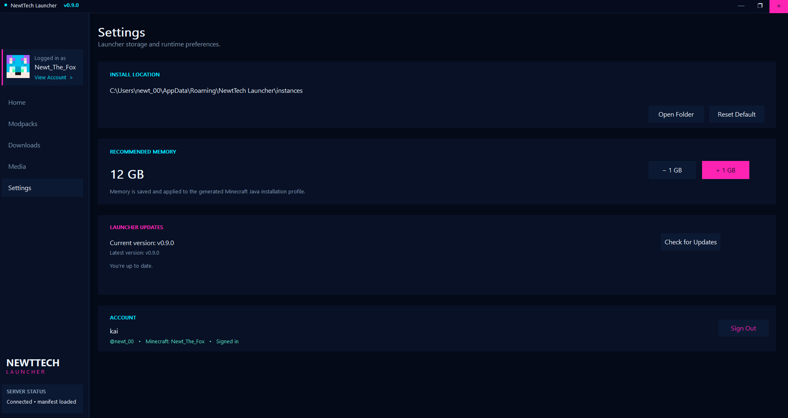

# NewtTech Launcher

<p align="center">
  
</p>

<p align="center">
  <strong>A modern native Windows launcher for managed Minecraft modpacks.</strong>
</p>

<p align="center">
  <a href="https://github.com/newt0000/NewtTechLauncher/releases/latest"></a>
  <a href="https://github.com/newt0000/NewtTechLauncher/releases"></a>
  <a href="https://github.com/newt0000/NewtTechLauncher/actions/workflows/build.yml"></a>
  
  
  <a href="LICENSE"></a>
</p>

<p align="center">
  <a href="https://github.com/newt0000/NewtTechLauncher/releases/latest"><strong>Download Latest Release</strong></a>
  ·
  <a href="https://github.com/newt0000/NewtTechLauncher/issues">Report a Bug</a>
  ·
  <a href="https://github.com/newt0000/NewtTechLauncher/actions">Builds</a>
</p>

---

## About NewtTech Launcher

**NewtTech Launcher** is a native Windows application built to simplify installing, maintaining, repairing, and launching managed Minecraft modpacks.

Instead of requiring players to manually assemble mods, match Forge versions, create Minecraft profiles, and keep files synchronized, the launcher uses remotely managed pack manifests to automate the process.

Select a pack, install it, and launch it through the official Minecraft Launcher.

<span style="color:red;"><strong>NOTE:</strong> this software does not collect information or contain any malicious code, as of now im awaiting SignPath's response for my CodeSign application to sign the code, windows defender may or will flag it as unknown and potentially malicious you can tap more info and launch anyway to bypass this</span>
<p align="center">
  
</p>

---

## Features

### Managed Modpack Library

Available packs are retrieved from the NewtTech launcher service and displayed directly in the launcher.

Each pack can provide:

- Pack name and description
- Custom transparent PNG icon
- Custom banner artwork
- Pack version
- Minecraft version
- Forge version
- Server address
- Managed file count
- Installation metadata

### Automatic Installation

The launcher automatically creates and prepares a dedicated instance for each pack.

Managed content can include:

- Mods
- Configuration files
- Resource files
- Pack-specific assets
- Required supporting files
- Minecraft version data
- Forge version files

The pack manifest determines which files belong to an installation, eliminating the need to manually assemble the modpack.

<p align="center">
  
</p>

### Minecraft Launcher Integration

NewtTech Launcher works alongside the **official Minecraft Launcher**.

It does not replace Microsoft or Minecraft authentication.

For supported packs, the launcher can automatically create a Minecraft installation profile containing:

- The required Minecraft version
- The required Forge version
- A dedicated game directory
- Pack-specific profile information
- A custom pack icon

After preparation, the official Minecraft Launcher can be opened with the installation ready to launch.

### Automatic Forge Provisioning

The required Forge installation can be provisioned automatically.

Version files are installed into the normal Minecraft versions directory:

```text
.minecraft/versions/
```

The generated Minecraft profile is then configured to use the appropriate Forge version.

### Verify & Repair

**Verify / Repair** checks an installed pack against its managed manifest.

It can recover files that are:

- Missing
- Damaged
- Outdated
- Incorrect

This makes it possible to repair a pack without manually finding and replacing individual files.

### Refreshable Pack Catalog

The **Refresh** function retrieves current launcher and pack metadata from the server.

Pack information can therefore be updated remotely without requiring users to reinstall the launcher.

### Dedicated Pack Instances

Each managed modpack uses its own instance directory.

This keeps pack-specific mods and configuration separate from the player's primary Minecraft installation and allows multiple managed packs to coexist.

### Downloads

The Downloads section provides a dedicated view for launcher-managed download activity.

<p align="center">
  
</p>

### Settings

Launcher preferences and configurable behavior are available from the Settings section.

<p align="center">
  
</p>

---

## Native Windows Interface

NewtTech Launcher uses a custom native Windows interface rather than an embedded web page.

The interface includes:

- Custom NewtTech title bar and window frame
- Resizable application window
- Custom minimize, maximize, and close controls
- Dark navy visual theme
- Cyan and magenta accents
- Dynamic pack cards
- Pack banners and icons
- PNG alpha transparency
- Responsive layout
- Native Win32 drawing and controls

---

## How It Works

```text
NewtTech Launcher
        │
        ▼
Retrieve Pack Manifest
        │
        ▼
Select Modpack
        │
        ├──────────────────┐
        ▼                  ▼
     Install          Verify / Repair
        │                  │
        └─────────┬────────┘
                  ▼
          Prepare Instance
                  │
                  ▼
          Provision Forge
                  │
                  ▼
      Create Minecraft Profile
                  │
                  ▼
      Open Minecraft Launcher
                  │
                  ▼
                 Play
```

---

## Installation

### Download the Installer

<p align="center">
  <a href="https://github.com/newt0000/NewtTechLauncher/releases/latest">
    
  </a>
</p>

Download the latest release and run:

```text
NewtTechInstaller.exe
```

The installer handles installation of the launcher and its required runtime components.

It can also:

- Create a desktop shortcut
- Create Start Menu shortcuts
- Register the uninstaller
- Launch NewtTech Launcher when installation completes

---

## System Requirements

| Component | Requirement |
| --- | --- |
| Operating System | Windows 10 or Windows 11 |
| Architecture | x64 |
| Minecraft | Official Minecraft Launcher |
| Network | Internet connection |
| Storage | Varies by installed modpack |
| Minecraft Account | Managed by the official Minecraft Launcher |

Individual packs may require additional RAM, storage, or graphics capability.

---

## Building From Source

NewtTech Launcher uses **CMake**, **Ninja**, and **MinGW-w64/GCC**.

### Requirements

- Git
- CMake
- Ninja
- MinGW-w64 / GCC
- Windows-compatible development headers and libraries

Clone the repository:

```bash
git clone https://github.com/newt0000/NewtTechLauncher.git
cd NewtTechLauncher
```

Configure a release build:

```bash
cmake -S . -B build -G Ninja -DCMAKE_BUILD_TYPE=Release
```

Build the project:

```bash
cmake --build build
```

The primary Windows targets are:

```text
NewtTechLauncher
NewtTechInstaller
```

---

## Automated GitHub Builds

NewtTech Launcher includes a GitHub Actions build pipeline.

<p align="center">
  <a href="https://github.com/newt0000/NewtTechLauncher/actions/workflows/build.yml">
    
  </a>
</p>

The workflow:

1. Checks out the public source repository.
2. Creates a Windows MinGW build environment.
3. Configures the project with CMake.
4. Builds `NewtTechLauncher.exe`.
5. Builds `NewtTechInstaller.exe`.
6. Uploads both executables as a GitHub Actions artifact.

The resulting unsigned build artifact is named:

```text
newttech-windows-unsigned
```

---

## Project Structure

```text
NewtTechLauncher/
│
├── .github/
│   └── workflows/
│       ├── build.yml
│       └── release-sign.yml
│
├── installer/
│   └── Installer.c
│
├── src/
│   ├── MainWindow.cpp
│   ├── ImageLoader.cpp
│   ├── HttpClient.cpp
│   ├── InstallEngine.cpp
│   ├── MinecraftProfile.cpp
│   ├── VersionManager.cpp
│   ├── Settings.cpp
│   └── ...
│
├── assets/
│   ├── launcher-logo.png
│   └── screenshots/
│       ├── modpacks.png
│       ├── install.png
│       ├── downloads.png
│       └── settings.png
│
├── CMakeLists.txt
├── CODE_SIGNING.md
├── LICENSE
└── README.md
```

---

## Pack Management

NewtTech Launcher is built around remotely managed pack manifests.

A pack can define information such as:

```json
{
  "name": "Example Pack",
  "version": "1.0.0",
  "minecraft": "1.20.1",
  "forge": "47.4.22",
  "server": "example.net:25565"
}
```

The launcher uses the server-provided metadata and managed file list to construct and maintain the local instance.

This allows pack content to be updated centrally without requiring players to manually locate and replace individual files.

---

## Artwork Support

Managed packs can provide their own visual identity.

Supported artwork includes:

- Pack icons
- Pack banners
- Minecraft profile icons
- Launcher artwork

PNG artwork supports alpha transparency.

Recommended repository layout for README artwork:

```text
assets/
├── launcher-logo.png
└── screenshots/
    ├── modpacks.png
    ├── install.png
    ├── downloads.png
    └── settings.png
```

If your filenames differ, simply change the corresponding `src="..."` paths in this README.

---

## Security & Code Signing

NewtTech Launcher does not handle Microsoft account credentials itself. Minecraft authentication remains the responsibility of the official Minecraft Launcher.

Managed launcher and modpack content is retrieved from the configured launcher service over HTTPS.

Official builds are designed to be reproducibly built from the public source repository through GitHub Actions.

For code-signing and release-build information, see:

**[CODE_SIGNING.md](CODE_SIGNING.md)**

---

## Troubleshooting

### A pack does not appear

Use **Refresh** to retrieve the latest pack manifest.

### A pack will not launch

Run **Verify / Repair** to check the managed installation before reinstalling the entire pack.

### Minecraft installation is missing

Install the official Minecraft Launcher and launch it at least once.

### Forge is missing

Use **Verify / Repair** or reinstall the affected pack so the required Forge version can be provisioned.

### Mods or managed files are missing

Use **Verify / Repair** to compare the local instance against the current server manifest.

---

## Releases

<p align="center">
  <a href="https://github.com/newt0000/NewtTechLauncher/releases/latest">
    
  </a>
  <a href="https://github.com/newt0000/NewtTechLauncher/releases">
    
  </a>
</p>

Release history and downloadable builds are available from the repository's **Releases** section.

---

## Development Status

NewtTech Launcher is under active development.

Launcher behavior, server APIs, manifest formats, installation behavior, and interface components may continue to evolve between releases.

Found a problem or have an improvement in mind?

<p align="center">
  <a href="https://github.com/newt0000/NewtTechLauncher/issues">
    
  </a>
</p>

---

## License

NewtTech Launcher is released under **CC0 1.0 Universal**.

See **[LICENSE](LICENSE)** for the complete license terms.

<p align="center">
  <a href="LICENSE">
    
  </a>
</p>

---

<p align="center">
  
</p>

<p align="center">
  <strong>NewtTech Launcher</strong><br>
  Install. Repair. Launch.
</p>
